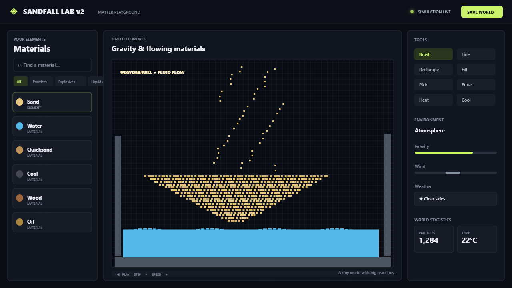
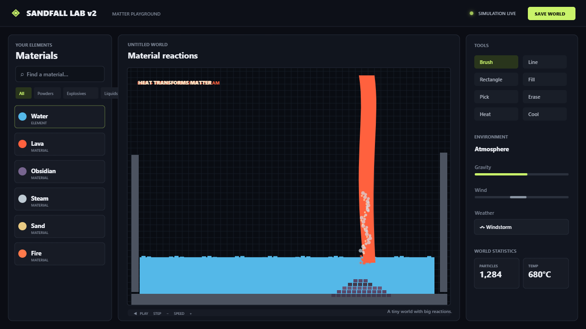
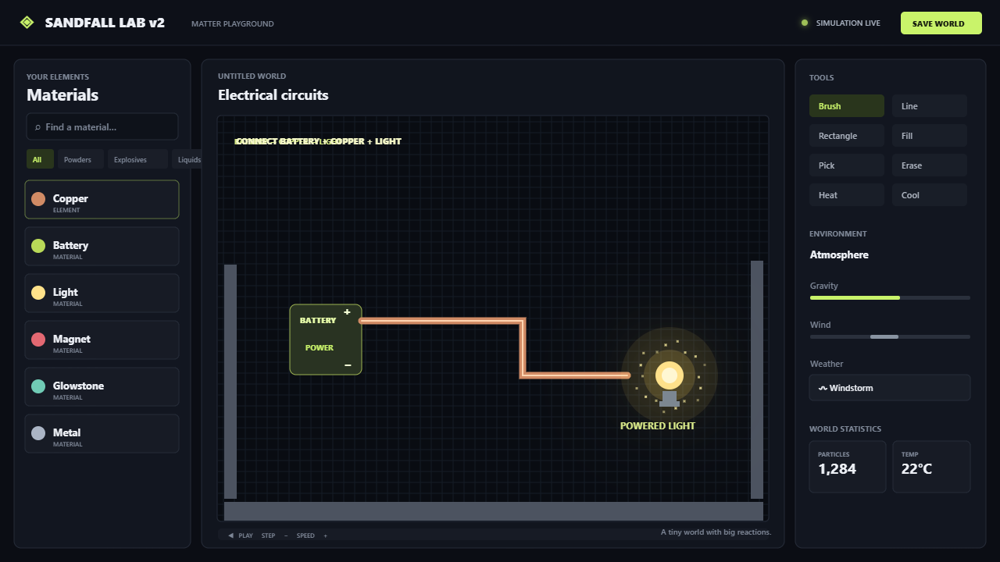

# Sandfall Lab v2

Sandfall Lab v2 is a browser based particle and physics sandbox. Choose a material, paint it into the world, then watch gravity, flowing liquids, heat, weather, reactions, and electrical circuits shape the scene. It runs locally in a modern browser and has no build step or third party JavaScript dependencies.

## Preview

The animated overview and images are illustrated previews of the interface and representative material interactions.

<p align="center">
  <video src="media/sandfall-lab-demo.webm" controls width="960" poster="media/overview.png">
    Your browser cannot play this WebM video. <a href="media/sandfall-lab-demo.webm">Open the demo video</a>.
  </video>
</p>

### Screenshots







## Run it

1. Open `index.html` in a current desktop browser.
2. Choose a material from the left panel.
3. Paint on the world canvas and press **Play** to start the simulation.

For local web serving, run this command from the project folder and open `http://127.0.0.1:8000`:

```sh
python -m http.server 8000 --bind 127.0.0.1
```

The simulation uses a 240 by 132 cell canvas. Each cell stores its material and state such as heat, lifetime, and liquid flow direction. On each simulation step, cells update from the bottom upward, attempt to move according to gravity and material density, and react with nearby cells. Rendering adds animated surface highlights, material glow, sparks, and other particle effects on top of the cell grid.

## Rebuild the README media

The preview page draws the illustrated screenshots and records the WebM video in the browser. To regenerate the assets, run `node tools/capture-server.cjs`, then open `http://127.0.0.1:8765/media/generate-media.html`. The generator saves the images and video into `media/`; stop the local server with **Ctrl+C** when finished.

## Materials

The palette groups materials by type. Use the category tabs and search box to find them.

| Category | Materials |
| --- | --- |
| Powders | Sand, Snow, Seed, Salt, Gunpowder, Clay, Ash, Coal |
| Explosives | Gunpowder, TNT, Dynamite, C4, Nitro |
| Liquids | Water, Oil, Acid, Mud, Quicksand |
| Energy | Fire, Lava, Steam, Smoke, Meteorite |
| Nature | Wood, Plant |
| Life | Firefly, Fish, Beetle |
| Solids | Stone, Wall, Ice, Glass, Metal, Brick, Rubber, Obsidian, Magnet, Glowstone |
| Electrical | Copper, Battery, Light, Burnt wire |

Powders fall and pile up. Liquids spread and flow at different rates. Heat can melt ice and snow, dry mud, light combustible materials, and trigger explosive materials. Fire and lava interact with nearby matter; explosions use different sizes and shapes. Acid dissolves many materials. Fish need nearby water to survive, while plants and creatures add growing and movement behaviors.

## Example reactions

| Materials | Result |
| --- | --- |
| Water + Sand | Quicksand |
| Water + Clay | Mud |
| Water + Lava | Steam and Obsidian |
| Sand + Lava | Glass |
| Fire + Wood, Oil, Coal, or Rubber | Fire spreads; burning material eventually fades |
| Fire or Lava + Explosives | A blast, with a profile determined by the explosive |
| Acid + many materials | The touched material dissolves over time |

## Electrical circuits

- Paint a Battery, then connect it to Copper. Orthogonally touching copper cells form a conductor network.
- Place a Light next to the powered battery or copper network. Connected lights share the available battery power: larger batteries make them brighter and extend their glow farther.
- A heavily loaded, thin copper wire can heat up and turn into Burnt wire, which no longer conducts. Wider copper traces tolerate more current, and water touching copper cools it.

## Tools and controls

| Tool | Action |
| --- | --- |
| Brush | Paint the selected material |
| Line / Rectangle | Draw straight lines or outlined shapes |
| Fill | Replace a connected region with the selected material |
| Pick | Select the material under the pointer |
| Erase | Remove cells |
| Heat / Cool | Apply local temperature changes |

Adjust brush size and density to control how much material each stroke places. The environment panel controls gravity, wind, atmosphere, and weather (clear skies, rain, snow, windstorm, heatwave, or meteor shower). Pause, step, and speed controls let you choose how the simulation advances. Undo and redo, save and load world files, and sound controls are available in the toolbar.

Keyboard shortcuts include **B** brush, **L** line, **R** rectangle, **F** fill, **I** pick, **E** erase, **H** heat, **C** cool, **Space** pause/resume, **Ctrl+Z** undo, **Ctrl+Y** redo, **/** search materials, and **Shift+X** clear the world.

## Project files

- `index.html` — application layout and browser entry point.
- `style.css` — interface styling and responsive layout.
- `app.js` — material definitions, cell simulation, reactions, tools, rendering, and world save/load.
- `media/` — README screenshots and the demo video.
- `media/generate-media.html` and `tools/capture-server.cjs` — local preview media generator and its save endpoint.
